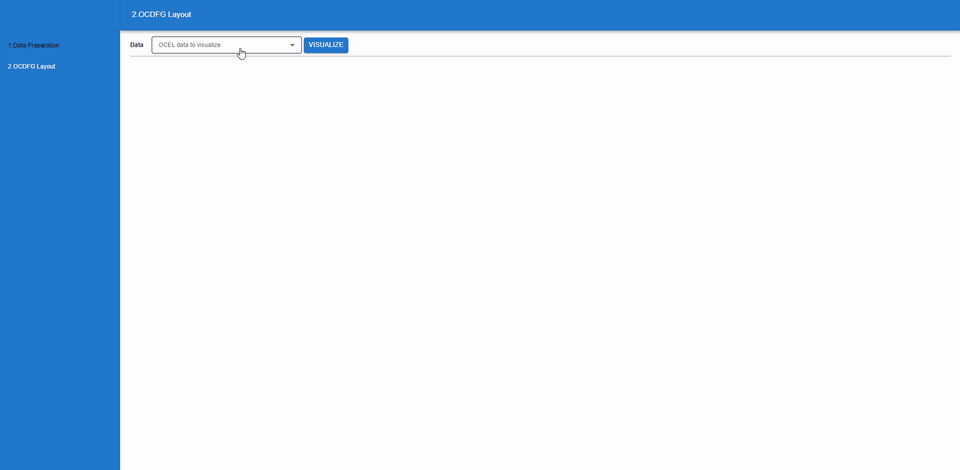

# OCDFG Layout

Layout algorithm and interactive viewer for **object-centric directly-follows graphs (OC-DFG)**.

An OCEL 2.0 log is split into one directly-follows graph per object type. Every activity gets a
common rank (ILP), each object type is laid out on its own vertical axis, and the axes are merged
one by one so that activities shared between object types line up. Filtering (by object type or
edge frequency) re-runs only the placement step on the cached layout, so the graph stays stable
and the node movement can be measured.

```
backend/    FastAPI server + the `ocdfg_layout` Python package (the algorithm)
frontend/   React web app: upload logs, draw the layout, filter, zoom
```

## Demo



Full-resolution recording: [docs/ocdfg_layout_record.mp4](docs/ocdfg_layout_record.mp4)

## Requirements

- Python 3.10+ and a **Gurobi** license (`gurobipy` is used for rank assignment; the free
  academic license is enough)
- Node.js 18+

## Quick start

```bash
# backend
cd backend
python -m venv .venv
# Windows: .venv\Scripts\activate   |   macOS/Linux: source .venv/bin/activate
pip install -r requirements.txt
uvicorn main:app --host 0.0.0.0 --port 8000 --reload
```

```bash
# frontend (second terminal)
cd frontend
npm install
npm start          # http://localhost:3000
```

Then open http://localhost:3000:

1. **Data Preparation** – upload an OCEL 2.0 JSON file under a name.
2. **OCDFG Layout** – pick the log and press *Visualize*. Untick object types and/or move the
   edge-frequency slider, then *Apply* to filter. Click an edge for its source, target and
   frequency. Zoom with the slider or Ctrl + mouse wheel; *Reset* fits the whole drawing again.

## How the layout is computed

`MultiObjectGraph.generate_layout_from_log` (see `backend/ocdfg_layout/MultiObjectGraph.py`):

1. **Log → graphs**: case variants become nodes/edges per object type; every type gets a
   `<type> start` / `<type> end` node.
2. **Rank assignment**: one ILP (Gurobi) assigns a rank to every activity, minimising weighted
   precedence violations and edge length, with every node between the start and end node of
   each of its object types.
3. **Per-type layout** (`process_layout/Graph.py`): the most frequent variant becomes the
   backbone (order 0), the remaining components are balanced left/right, long edges get virtual
   bend nodes, and a weighted-median sweep reduces crossings.
4. **Axis merging**: starting from the type that shares the most activities, the most similar
   remaining type is added at the axis position with the lowest cost
   `λ1 · crossing_cost + λ2 · axis_distance_cost` (`LAMBDA_EDGE_CROSS`, `LAMBDA_AXIS_DIST`).
5. **Global crossing reduction**: after an adjacent-axis-swap pass, non-backbone nodes are
   re-ordered within their own axis and rank (median sweeps, single-node moves into free slots
   on either side of the backbone, whole-chain moves for long edges); the axis order and the
   backbone columns stay fixed. A->B / B->A pairs are laid out as one double-headed edge and
   counted as two edges.
6. **Placement**: x positions by a median heuristic without overlaps, long edges straightened
   (`EDGE_STRAIGHTENING` in `conf.py`), layout centred, SVG coordinates and edge polylines.

Filtering (`recompute_filtered`) keeps the ranks, axis order and node order from the cached
layout and repeats only step 6, returning the same output plus `movement` statistics.

## Backend

Uploaded logs are stored in `backend/data/<name>/`; seven preprocessed sample logs
(blockchain, hinge, hiring, hospital, logistics, o2c, p2p) are included, so the app works right
after start-up. Computed layouts are cached as pickles in `backend/pickles/` (git-ignored) –
the filter endpoints reload that pickle, so a filter never recomputes the ranks. Override the
locations with `OCDFG_DATA_DIR` and `OCDFG_PICKLE_DIR`.

### API

| Method | Path | Body / query | Description |
| --- | --- | --- | --- |
| GET | `/ocel-list` | – | Names of uploaded logs |
| POST | `/ocel-upload` | `{data_name, d}` | `d` is the OCEL 2.0 JSON as a string |
| GET | `/ocel-info` | `?data_name=` | Object types of a log |
| DELETE | `/ocel-remove` | `{data_name}` | Delete an uploaded log |
| GET | `/ocel-process-layout` | `?data_dir=` | Compute the layout; returns `output`, `pickle_path`, `layout_time_seconds` |
| POST | `/filter-layout` | `{pickle_path, object_types?, filter_value?}` | Keep only the given object types and/or the top `filter_value` % of edges by frequency (what the UI uses) |
| POST | `/filter-layout-by-value` | `{pickle_path, filter_value}` | Frequency filter only |
| POST | `/filter-layout-from-pickle` | `{pickle_path, kept_edge_keys}` | Keep an explicit set of edge keys (`"source-target-type"`) |

`output` contains `nodes` (with `nodes_visualized`: one sub-circle per object type), `edges`
(polyline `data` per original edge), `object_axis_order`, `edge_crosses`, `maxFreq`/`minFreq`,
`radius` and, for filters, `movement`.

### Using the package directly

```python
import json
from ocdfg_layout import MultiObjectGraph
from ocdfg_layout.preprocess import ocel_to_layout_log

with open("log.json", encoding="utf-8") as f:
    ocel = json.load(f)

_, log = ocel_to_layout_log(ocel)          # OCEL 2.0 -> case variants per object type
output, mog = MultiObjectGraph.generate_layout_from_log(log)
filtered = mog.recompute_filtered(object_types=["Order", "Item"], filter_value=50)
```

### Tuning

| Where | Setting | Meaning |
| --- | --- | --- |
| `ocdfg_layout/conf.py` | `RANK_HEIGHT`, `ORDER_WIDTH`, `NODE_GAP`, `NODE_MIN_WIDTH`, `NODE_CHAR_WIDTH`, `RADIUS`, … | Drawing geometry (SVG user units) |
| `ocdfg_layout/conf.py` | `EDGE_STRAIGHTENING` | `'vertical'` (default), `'diagonal'` or `None` |
| `ocdfg_layout/conf.py` | `AXIS_SLACK_SLOTS` | Extra order slots per axis side available to the crossing reduction (2) |
| `MultiObjectGraph` | `LAMBDA_EDGE_CROSS`, `LAMBDA_AXIS_DIST` | Weights of the axis-position cost (10 / 0.3) |

The frontend scales its node/edge sizes from the `radius` in the response, so changing the
geometry only needs a backend restart.

## Frontend

Create React App + MUI. `src/pages/OCDFGLayout.js` renders the SVG; `src/services/API.js` wraps
the endpoints above. The backend URL defaults to `http://localhost:8000`; set
`REACT_APP_API_HOST` (see `frontend/.env.example`) to change it. `npm run build` produces a
static build in `frontend/build/`.

## Package layout

```
backend/
  main.py                 FastAPI app
  ocdfg_layout/
    MultiObjectGraph.py   the OC-DFG layout (steps 1–6 above) and filtering
    ObjectGraph.py        laid-out graph of one object type (ObjectNode / ObjectEdge)
    preprocess.py         OCEL 2.0 JSON -> case variants per object type
    conf.py               drawing constants
    process_layout/       single-object layered layout used per object type
      Graph.py            backbone, virtual nodes, component balancing, crossing reduction
      Node.py, Edge.py, Component.py, geometry.py, Util.py
frontend/
  src/pages/DataPreparation.js   upload / delete logs
  src/pages/OCDFGLayout.js       layout view, filters, zoom
  src/services/API.js            backend calls
```
